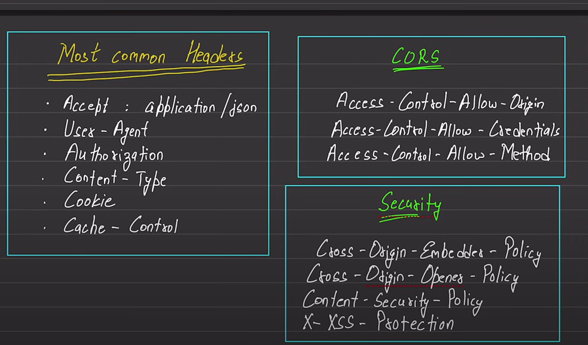

# HTTP CRASH COURSE
Hyper Text Transfer Protocol

**HTTP (Hypertext Transfer Protocol):**
- **Definition:** HTTP is a protocol used for transferring data over the web. It is the foundation of any data exchange on the Internet.
- **How it Works:** When you type a website address in your browser and hit Enter, your browser sends an HTTP request to the server, which then responds with the requested web page or resource.

**HTTPS (Hypertext Transfer Protocol Secure):**
- **Definition:** HTTPS is a secure version of HTTP, adding a layer of security through the use of encryption.
- **How it Works:** Similar to HTTP, but with an added layer of SSL/TLS encryption. This encryption ensures that the data exchanged between your browser and the server is secure, protecting it from potential eavesdropping or tampering.

**In Short:**
- **HTTP:** Basic protocol for transferring data on the web.
- **HTTPS:** Secure version of HTTP, encrypting data to enhance security during transmission. Use HTTPS for sensitive information like passwords and payment details.

url , uri and urn -> location

http headers = metadata = key value pair sent along with request and response

Used for - caching, authentication and manage state of user(loged in , loged out,rtc)

header categories
- request headers = when data is coming from clients,When your web browser sends a request to a server to retrieve a web page or some other resource, it includes additional information in the form of headers.
- response headers = when data comes from server,After the server processes your request, it sends back a response containing the requested resource along with additional information in the form of headers.
- representation headers = tell which type of encoding or compression of data and represent them properly. Eg)mobile data , apps that have data
- payload  = data =refer to the headers that are part of the actual data being sent, not the metadata like request or response headers., id: , username:

Most common headers ->

- Accept=  metadata = application/json, which type of data is accepted
- user agent = konsi application se req ayi hai , postman se ayi hai or browser se ayi hai, mobile se hai, isko use krke , hum suggest bhi krte hai ki agar req mobile se aa rhi hai to download the app,etc
- Authorization = Bearer _______ = send autorization token , access and refress token
- Content-Type = type of content , images ?
- cookie = cookie key value pair
- cache control = how long we need to store data in network

CORS Headers 
They are set according to company policy

Access Control Allow Origin : domain name from where the request can be made. * means all domains

## HTTP Methods - 
Basic set of operations that can be used to interact with server 

GET - retieve a resource, eg-give user with specific mail

HEAD - get header information about a resource(response headers)

POST - create a new resource / submit data

PUT - replace an existing resource

PATCH - partial update of a resource, change a part 

DELETE - delete a resource

OPTIONS - describe communication options for a target resource, what options available for a particular route

TRACE - echo/loop back the received request so that a client can test whether it has reached the server

CONNECT - establish a tunnel to transfer data between two servers

### Status Codes
1xx - informational responses

2xx successfull http requests

3xx redirection messages - response moved to another message

4xx client errors - like wrong password

5xx server error 

0-99 Informational
100-199 Synchronous
200-299 Successful
300-399 Redirections
400-499 Client Error
500-599 Server Error

they are set according to company standard

