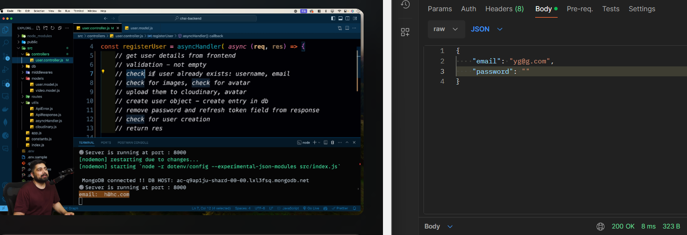

# Logic building and Register controller

- req.body => when data coming from form or direct JSON

1. made algo for registration process

2. started wrting code in user.controller.js
```js
/*
  steps for user registration:-
    1.  get the user details from the frontend.
    2.  validation- not empty.
    3.  check if user exist : username,email.
    4.  check for images,check for avatar.
    5.  upload the images on cloudinary,upload (check the) avatar.
    6.  create a user object-create entry in db.
    7.  remove password and refreshTokend from the responce.
    8.  check for user creation
    9.  return responce.
    */
```
While writing 2.1 Step- **get user details from frontend**
    - took data from req.body and tested it by sending request in postman
    
    - then realised that we also need to handle files , for that we went to user.routes.js and imported upload variable present in multer middleware, so that we can upload two files.
    - `upload.single` - upload single file
    - `upload.array` - upload multiple files at a **single** field
    - `upload.fields([{f1},{f2},..{fn}])` - upload multiple files associated with different fields, in our case we need two fields, avatar and coverImage.
    - So we will add this middleware in between `/register` and post data
    - updated code in `../routes/user.routes.js`- 
```js
router.route("/register").post(
  upload.fields([
    {
      // name of the fields
      // should be same at fronend
      // this communication should be there between
      // backedn and frontend developer
      name: "avatar",
      // how many files you want to upload?1
      maxCount: 1,
    },
    {
      name: "coverImage",
      maxCount: 1,
    },
  ]),
  registerUser
);

```
-----

- While writing 2.2 Step- **validation - check fields not empty**
    - optimal way to validate
```js
// There are 2 ways to validate the information optimal(2nd way) && 1st way as follows. 

// 1st way to validate the information

    if(fullName===""){
        throw new ApiError(400,"fullname is required");
    }
    else if(email==="" && !email.includes('@')){
        throw new ApiError(400,"you entered wrong email");
    }
    else if(userName===""){
        throw new ApiError(400,"username is required");
    }
    else if(password===""){
        throw new ApiError(400,"password is required");
    }

// 2nd way || optimal way to validate the information
    
    if(
        [ fullName , email , userName , password ].some( (field) => field?.trim() === "")
    ){
        throw new ApiError(400,"all fields are required");
    }

```
----
- While writing 2.3 Step- **check if user already exists: username , email**
    - import User mode in user controller
    - User model is campable of calling your mongo db whenever needed
    - `User.findOne({$or:[{username},{email}]})` - to find one of them
    - if  found then throw error
----
- While writing 2.4 Step- **check for images and avatar**
    - Now since we wrote multer middleware in between register route and post, it provides us , `req.files`
    - So now we can use that data to see whether any image has been uploaded or not
    - to retrieve the file path of avatar and cover image,
    we use `const avatarLocalPath = req.files?.avatar[0]?.path;` 
    - if no image is there then , we throw ApiError
----
- While writing 2.5 Step- **upload them to cloudinary and check if they have successfully uploaded or not**  
    - import uploadOnCloudinary function from utils/cloudinary.js
    - NOTE- In cloudinary.js we have logic for uploading and in case upload fails we delete the file from localServer, but we also need to delete the file from local server when uploaded suxesfully on cloudinary, that PART, we'll deal later
```js
//  Step 5:

    const avatar=await uploadOnCloudinary(avatarLocalPath);
    const coverImage=await uploadOnCloudinary(coverImageLocalpath);
    
    if(!avatar){
        throw new ApiError(404,"avatar is required");
    }
```
- While writing 2.6 Step- **create user object , create entry in db**  
    - for each entry mongoDb associates a unique _id by default
```js
//  Step 6:

    const user=await User.create({
        fullName,
        avatar:avatar.url,
        coverImage:coverImage?.url || "",
        email,
        password,
        userName:userName.toLowercase()
    });
```
----
-  writing 2.7,8 and 9 Step- **remove password and refresh token field from response check for user creation and return response**  
    - we select the user with that particular id and ignore "password" and "refreshToken" field
```js
//  Step 7:
    
    const createdUser=User.findById(user._id).select(
        "-password -refreshToken"
    );

//  Step 8:

    if(!createdUser){
        throw new ApiError(500,"something went wrong while registring the user");

    }

//  Step 9:
    
    return res.status(201).json(
        new ApiResponce(200,createdUser,"User registered Successfully")
    )
```
----


