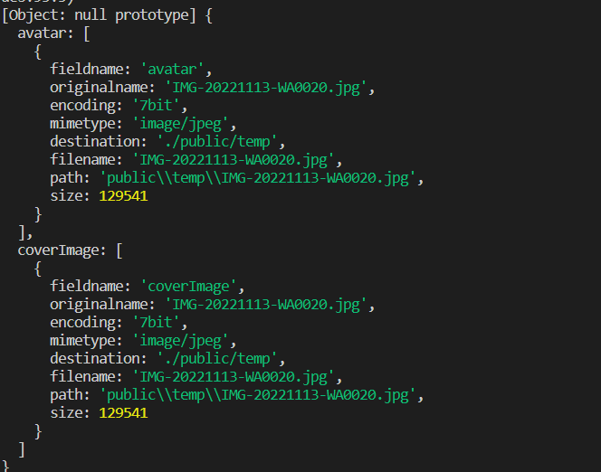

# How to use postman for backend


present in mongo db at, database>data services

At Cloudinary - 


unlinkSync from cloudinary


req.files on console -


postman look

User response - 
```json
{
    "data": {
        "_id": "65cb1408eccf6010fbfed53c",
        "userName": "abhsd",
        "email": "ai@gmail.com",
        "fullName": "Abhishek",
        "avatar": "http://res.cloudinary.com/dx01xk4eh/image/upload/v1707807750/ivugbmwzazrhtse8tdqu.jpg",
        "coverImage": "http://res.cloudinary.com/dx01xk4eh/image/upload/v1707807751/ilcsxobnemjkgljjxs3j.jpg",
        "createdAt": "2024-02-13T07:02:32.662Z",
        "updatedAt": "2024-02-13T07:02:32.662Z",
        "__v": 0
    },
    "message": "User registered Successfully",
    "statusCode": 200,
    "success": true
}
```

what if coverImage not sent?

TypeError: Cannot read properties of undefined 

To resolve - 
```js
let coverImageLocalPath;
  if(req.files && Array.isArray(req.files.coverImage) && req.files.coverImage.length >0){
    coverImageLocalPath=req.files.coverImage[0].path;
  }
```

Postman setup done

Final user.controller.js debugged code - 
```js

import { asyncHandler } from "../utils/asyncHandler.js"
import { ApiError } from "../utils/ApiError.js"
import { User } from "../models/user.model.js"
import { uploadOnCloudinary } from "../utils/cloudinary.js"
import { ApiResponce } from "../utils/ApiResponce.js"

const registerUser = asyncHandler( async (req,res)=>{
    
    /*
    steps for user registration:-
        1.  get the user details from the frontend.
        2.  validation- not empty.
        3.  check if user exist : username,email.
        4.  check for images,check for avatar.
        5.  upload the images on cloudinary,upload (check the) avatar.
        6.  create a user object-create entry in db.
        7.  remove password and refreshTokend from the responce.
        8.  check for user creation
        9.  return responce.
    */

//  Step 1:

    const {fullName,email,userName,password}=req.body
//  console.log("email",email);

// Step :Middleware.

    // before going to the next step you need to introduce middlware 
    // in order to save the avatar and coverImage.

//  Step 2:

    /* 1st way to validate the information
       check the readme file:-14LogicBuilding.
    */

    // 2nd way || optimalway to validate the information
    
    if(
        [ fullName , email , userName , password ].some( (field) => field?.trim() === "")
    ){
        throw new ApiError(400,"all fields are required");
    }

//  Step 3:

    const existedUser=await User.findOne({
        $or:[{userName},{email}]
    });

    if(existedUser){
        throw new ApiError(409,"user with this email or username exists please enter another");
    }

    console.log(req.files);

//  Step 4:
    
    const avatarLocalPath=req.files?.avatar[0]?.path;
    // const coverImageLocalpath=req.files?.coverImage[0]?.path;

    let coverImageLocalpath;
    if(req.files && Array.isArray(req.files.coverImage) && req.files.coverImage.length > 0)
    {
        coverImageLocalpath = req.files.coverImage[0].path;
    }

    if(!avatarLocalPath){
        throw new ApiError(404,"avatar is required avtarpath");
    }

//  Step 5:

    const avatar=await uploadOnCloudinary(avatarLocalPath);
    const coverImage=await uploadOnCloudinary(coverImageLocalpath);
    
    if(!avatar){
        throw new ApiError(404,"avatar is required");
    }

//  Step 6:

    const user=await User.create({
        fullName,
        avatar:avatar.url,
        coverImage:coverImage?.url || "",
        email,
        password,
        userName:userName,
    });

//  Step 7:
    
    const createdUser= await User.findById(user._id).select(
        "-password -refreshToken"
    );

//  Step 8:

    if(!createdUser){
        throw new ApiError(500,"something went wrong while registring the user");
    }

//  Step 9:
    
    return res.status(201).json(
        new ApiResponce(200,createdUser,"User registered Successfully")
    )

});

export {registerUser};

```