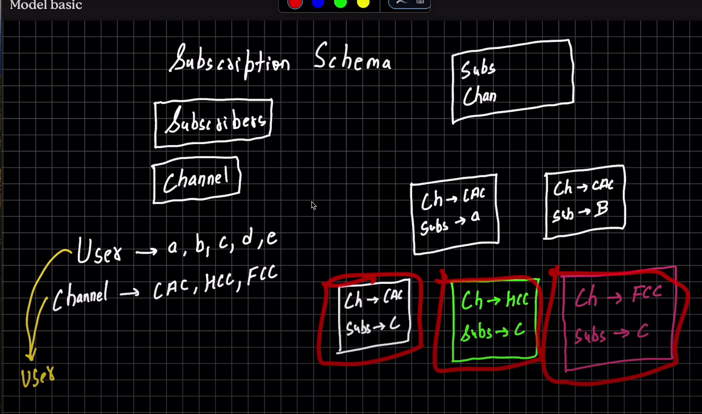

every time a user subscribes a channel a new document is created 

to count number of subscribers in a channel, we find those documents which have that channel and count them

to count how many channels the subcriber/user has subscribed , we find documents with that user/subscriber and count chanels ... Simple!