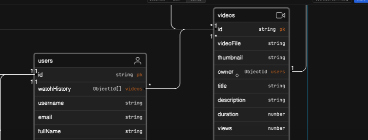

# How to write sub pipelines and routes



to get perfect document we will have to go through nested lookup as , user -> videos -> owner

---

### Note on _id

in mongoose in JS file if you are passing req.user._id then it will not be Object id that mongo db requires, but a **string** , the string is automatically converted to mongoDb object id by the mongoose

But... Be Carefull!⚠️ when we are writing req.user._id in aggregation pipeline , then the req.user_id is passed directly to mongoDb , which can create issues, To solve that, write ->

```js
{
          $match: {
              _id: new mongoose.Types.ObjectId(req.user._id)
          }
      },
```
in user.controller.js add watchHistroy function
```js
const getWatchHistory = asyncHandler(async (req, res) => {
  const user = await User.aggregate([
    // pipeline 1
    // get the document of the user, by matching his id
    {
      $match: {
        _id: new mongoose.Types.ObjectId(req.user._id),
      },
    },
    // pipeline2
    // look for the vidoos , which will have thumbnail, video, views, owner
    {
      $lookup: {
        from: "videos",
        localField: "watchHistory",
        foreignField: "_id",
        as: "watchHistory",
        // sub pipeline 2.1
        // for getting owner info from user document
        pipeline: [
          {
            $lookup: {
              from: "users",
              localField: "owner",
              foreignField: "_id",
              as: "owner",
              // subpipline 2.1.1
              // to include only specific fields from user collection
              pipeline: [
                {
                  $project: {
                    fullName: 1,
                    username: 1,
                    avatar: 1,
                  },
                },
              ],
            },
          },
          // subpipeline 2.2
          // override the existing owner field
          // reshape  the structure of owner by flatening the array
          {
            $addFields: {
              owner: {
                // select the value of first object
                // from existing owner arrays, to ensure that
                // there is only one owner of that video
                $first: "$owner",
              },
            },
          },
        ],
      },
    },
  ]);

  return res
    .status(200)
    .json(
      new ApiResponse(
        200,
        user[0].watchHistory,
        "Watch history fetched successfully"
      )
    );
});
```

in user.routes.js , add - 
```js
router.route("/change-password").post(verifyJWT, changeCurrentPassword);
router.route("/current-user").get(verifyJWT, getCurrentUser);
router.route("/update-account").patch(verifyJWT, updateAccountDetails);
router
  .route("/avatar")
  .patch(verifyJWT, upload.single("avatar"), updateUserAvatar);
router
  .route("/cover-image")
  .patch(verifyJWT, upload.single("coverImage"), updateUserCoverImage);

router.route("/c/:username").get(verifyJWT, getUserChannelProfile);
router.route("/history").get(verifyJWT, getWatchHistory);
```